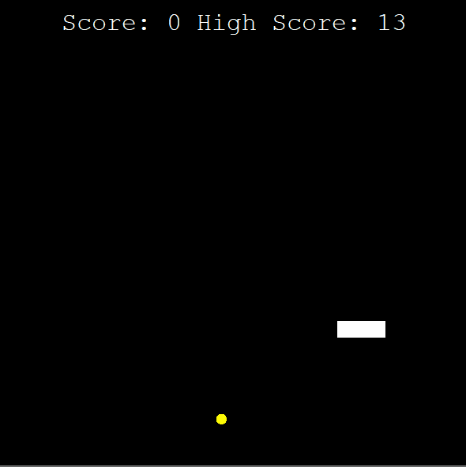

# SnakeGame

## Overview

A simple and classic **Snake Game** built with Python.  
Objective: Control the snake, collect food, and avoid crashing into walls or yourself.

## Preview



## Features

- Classic snake mechanics
- Increasing difficulty as the snake grows
- Score tracking
- Smooth gameplay

## Installation & Run Instructions

To play the game locally:

1. Clone this repository:
   ```bash
   git clone https://github.com/yourusername/snake-game.git
   cd *location of the projects files*
   ```
2. Make sure you have Python 3 installed.
   
3. Make sure you have the turle module installed, if not:
   ```bash   
   pip install turtle
   ```   
5. Run the game:
   ```bash
   python main.py
   ```
   or
   ```bash
   python3 main.py
   ```
## Requirements

- Installed Python 3
- Installed module turtle

### Disclaimer

This project is for educational purposes only
